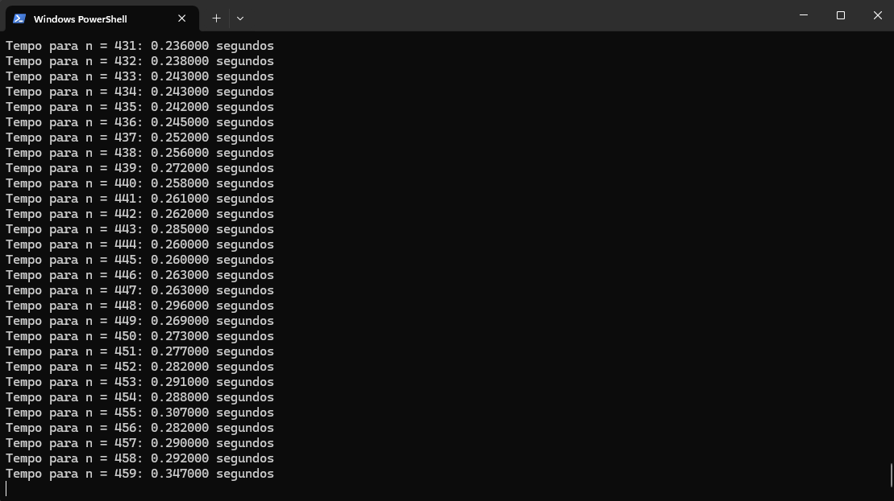
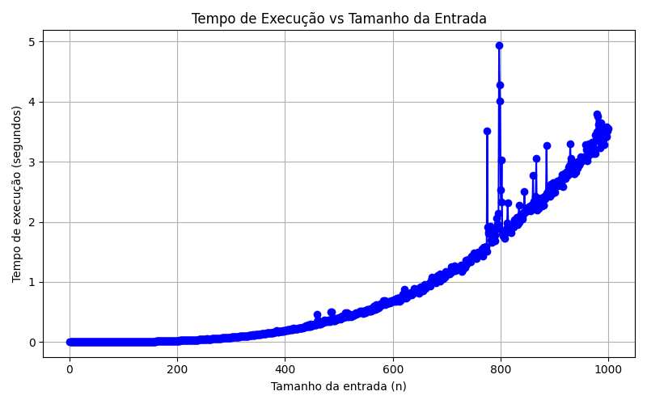

# Trabalho final de Complexidade de Algoritmos

### Este trabalho tem por objetivo o teste da complexidade de processamento de 4 diferentes algoritmos, sendo 2 deles P e outros 2 NP.

<i>Exemplo de algoritmo O(n³)</i>

 

<i>Gráfico plotado do mesmo algoritmo</i>

### Os algoritmos escolhidos para teste foram:

<ul>
    <li>P
        <ul>
            <li>Multiplicação de matrizes quadradas</li>
            <li>Bubble Sort</li>
        </ul> 
    </li>
    <li>NP
        <ul>
            <li>Força bruta para quebra de senhas.</li>
            <li>Problema da mochila 0/1.</li>
        </ul> 
    </li>
</ul>